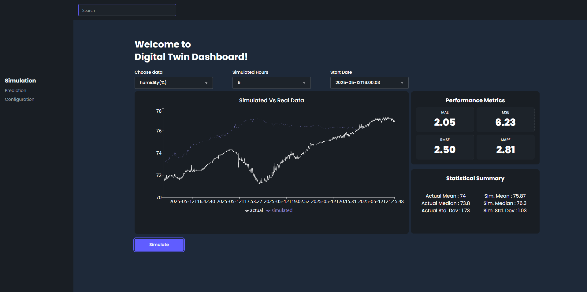

# 🌐 Digital Twin Dashboard (Frontend)

This is the frontend interface for the **Digital Twin Dashboard**, a web-based platform designed to visualize, simulate, and evaluate the performance of real-time IoT data against simulated data. It features interactive graphs, performance metrics (MAE, MSE, RMSE, MAPE), and statistical summaries from ESP32-based IoT networks.

---

## 🛠 Tech Stack

- ⚛️ **React.js** – Frontend framework
- 📦 **Axios** – API client for communicating with FastAPI backend
- 📊 **Recharts** – For interactive graph visualization
- 💨 **Tailwind CSS** – Utility-first CSS framework
- 🧪 **Vite** – Development build tool
- 🌐 **Supabase** – As a backend database (via API)

---

## 🚀 Features

- 📈 **Graphing (Line Chart)** of simulated vs. real IoT data  
- 📊 **Performance Metrics**: MAE, MSE, RMSE, MAPE  
- 📋 **Statistical Summary**: Mean, Median, Std. Dev (actual & simulated)  
- 🧠 **Dynamic Simulation Controls**: Start date, duration, and category  
- 💡 **Dark Mode UI** with modern layout and sidebar navigation  

## 📸 Sample Preview

### 🧑‍💻 Author
Built with 💡 by Fadel Daniswara
Electrical Engineering @ Universitas Indonesia | AIoT & Digital Twin Enthusiast